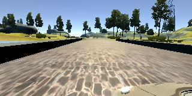

# Behavioral Cloning Project

[Full video on Vimeo](https://vimeo.com/226242722)

The goals / steps of this project are the following:
* Use the simulator to collect data of good driving behavior
* Build, a convolution neural network in Keras that predicts steering angles from images
* Train and validate the model with a training and validation set
* Test that the model successfully drives around track once without leaving the road
* Summarize the results with a written report

## Rubric Points

Here I will consider the [rubric points](https://review.udacity.com/#!/rubrics/432/view) individually and describe how I addressed each point in my implementation.  

---
### Files Submitted & Code Quality

#### 1. Submission includes all required files and can be used to run the simulator in autonomous mode

My project includes the following files:
* model.py containing the script to create and train the model
* drive.py for driving the car in autonomous mode
* model.h5 containing a trained convolution neural network 
* writeup_report.md summarizing the results

#### 2. Submission includes functional code
Using the Udacity provided simulator and my drive.py file, the car can be driven autonomously around the track by executing 

`python drive.py model.h5`

#### 3. Submission code is usable and readable

The model.py file contains the code for training and saving the convolution neural network. The file shows the pipeline I used for training and validating the model, and it contains comments to explain how the code works.

### Model Architecture and Training Strategy

#### 1. An appropriate model architecture has been employed

My model consists of a convolution neural network based on [NVIDIA's *End-to-End Deep Learning for Self-Driving Cars*](https://devblogs.nvidia.com/parallelforall/deep-learning-self-driving-cars/) blog post from August 2016. It contains 4 convolutional layers, followed by 4 fully connected layers and the output is a regression predicting the steering angle in radians. Zero is straight, negative is left turns, and positive are right turns.

The model includes ELU layers between each convolution and fully-connected layer to introduce nonlinearity. 

#### 2. Attempts to reduce overfitting in the model

The model contains dropout layers between all layers in order to reduce overfitting using lower probabilities in the first layers and then maxing out to 50% in the fully-connected layers.

Additionally, L2 regularization of the weights for all the neuron layers was added to the loss

The model was trained and validated on different data sets to ensure that the model was not overfitting (line 191-192). The model was tested by running it through the simulator and ensuring that the vehicle could stay on the track.

#### 3. Model parameter tuning

The model used an adam optimizer, so the learning rate was not tuned manually and the MSE (Mean Squared Error) between the predicted steering angle and the actual angle was the loss function. (model.py line 173)

#### 4. Appropriate training data

While I gathered a lot of additional training data, in the end the example training set of driving data provided by udacity was adequite for training this model and I was actually getting poorer results with custom data.

### Model Architecture and Training Strategy

#### 1. Solution Design Approach

The overall strategy for deriving a model architecture was to create a model that was robust enough to drive itself around the test track.

My first step was to use a convolution neural network model similar to AlexNet. I thought this model might be appropriate because it's not very complex and does reasonably well predicting 1000 classes on ImageNet. This problem required a regression prediction, so I swapped the last layer to be a single neuron output without any softmax layer. Keeping things simple, I also didn't include any regularization measures like dropout.

In order to gauge how well the model was working, I split my image and steering angle data into a training and validation set. I found that my first model had a low mean squared error on the training set but a high mean squared error on the validation set. This implied that the model was overfitting. 

To combat the overfitting, I modified the model to add dropout at first. This improved the MSE for the validation set, but when testing on the track the vehicle would run off the track, especially in the turns.

Then I iteratively started adding additional convolution and fully connected layers, but the model often didn't converge. I then added L2 regularization, which increased the total loss such that most of the time, the training set loss was higher than the validation set, but never got below a loss of 2. On the track, these new models performed very poorly and would often steer 100% to the left.

After many hours of trial and error, I just implemented the NVIDIA architecture completely, using code from [Nick (ncondo)](https://github.com/ncondo) to get to a known working state.

It turned out that my batch size I was using seemed to be why the model wouldn't converge. Usually it's recommended that you maximize your batch size until your GPU runs out of memory since you can take better Stochastic Gradient Descent (SGD) steps the more samples you have. While you should be taking better steps, you end up taking fewer steps (equal to the number of batches per epoch). When I decreased my batch size from 2048, down to just 64, the model finally converged to a loss of less than `1.0` after 28 epochs. While that worked in the simulation and it completed the track without crashing, I trained the same model for an additional 28 epochs and the validation loss descreased to 0.29.

The final step was to run the simulator to see how well the car was driving around track one. The final version performed even better, handling most of the driving smoothly. While the vehicle is able to drive autonomously around the track without leaving the road, it does take some wide turns in places that it needs to compensate for by turning hard at the last minute.

#### 2. Final Model Architecture

The final model architecture (model.py lines 130-170) consisted of a convolution neural network with the following layers and layer sizes:

 The first keras layer normalizes the RGB inputs of 0-255 to be between -0.5 and +0.5. Then the second keras layer crops the image by removing the top 40 pixels and the lower 20 pixels. (line 132 in model.py)

 Next, the first 3 convolutional layers have depths of 24, 36, and 48 respectively with 5x5 filter sizes and a stride of 2. This is followed by 2 more convolutional layers with a stride of 1 and depth of 64 and then a `Flatten()` keras layer to output a flat output of 1164 neurons. (model.py lines 140-156)

 The fully connected layers follow with 100, 50, and 10 neurons each and finally a single linear neuron outputs the predicted steering angle. (model.py lines 158-170)

Here is a visualization of the architecture:

]

#### 3. Creation of the Training Set & Training Process

To capture good driving behavior, I used the sample driving data. This data consisted of 8037 measurements of the steering angle as someone drove laps around test track 1 in the simulator. These steering angles at each timestep are matched to paths to 3 images (left, right center) captured from a set of virtual cameras on the front of the car. We consider the angle for the center image to be the angle we want our model to predict correctly.

The data is first split into a 90%-10% training and validation set. Then a generator is used to create a single batch by getting random timstamp samples from the training set and then randomly sampling the left, right or center image.

By capturing and image from the left, center, and right cameras at the same time, The left and right cameras can then be used as additional data points. For example, if the left camera image is used as an input, I adjust the steering angle by adding `0.275` radians to the measured steering angle, effectively telling the model that it should turn more to the right (or less to the left) if it encounters an input image like that.

To further augment the data set, I also randomize the brightness by converting from RGB to HSV and increasing or decreasing the brightness before converting it back to RGB for input into the model.

 Because much of the track is straight, most of the steering angles are zero or nearly zero and this can bias the training set to favor going straight instead of making turns when it should. To combat this bias, I limit samples where the steering angle is less than `0.1` radians to only 1/2 of the training set.

 Finally, I randomly flip the images and steering angles that are generated which removes the bias in the data for making left turns more frequently than left turns and effectively doubles the amount of training data the model sees.
